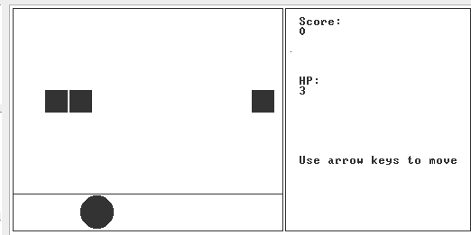

A shooting game made with Jack language in [Nand To Tetris](https://www.nand2tetris.org/) as a final project in the course "Introduction to Computer" of NTU.  

# Compile
Execute `JackCompile` in `tools` with parameter being the current directory.  

# Execute
Open `VMEmulator` in `tools` and load the current directory. After setting *Animate* to `No animation` and *speed* to `Fast`, click `>>`.
